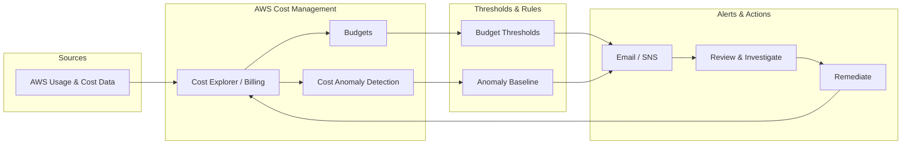

# Budget and Cost Anomaly Alerts in AWS

**Detailed documentation on AWS Budgets, Cost Anomaly Detection, and measures to minimize and control AWS account costs.**

---

| Author | Created on | Version | Last updated by | Last edited on | Pre Reviewer | L0 Reviewer | L1 Reviewer | L2 Reviewer |
|--------|------------|---------|-----------------|----------------|--------------|-------------|-------------|-------------|
| Mukesh Sharma | 03-02-2026 | v1.0 | Mukesh Sharma | 03-02-2026 |  |  |  |  |

---

## Table of Contents

1. [Introduction](#1-introduction)
2. [What Are Budget and Cost Anomaly Alerts](#2-what-are-budget-and-cost-anomaly-alerts)
3. [Why Use Budgets and Anomaly Detection](#3-why-use-budgets-and-anomaly-detection)
4. [Workflow Diagram](#4-workflow-diagram)
5. [Measures to Minimize AWS Cost](#5-measures-to-minimize-aws-cost)
6. [Advantages](#6-advantages)
7. [Best Practices](#7-best-practices)
8. [Conclusion](#8-conclusion)
9. [Contact Information](#9-contact-information)
10. [References](#10-references)

---

## 1. Introduction

**AWS Budgets** and **Cost Anomaly Detection** are AWS cost-management tools that help you set spending limits, track usage against those limits, and get alerted when costs deviate from what you expect. **Budgets** let you define cost or usage thresholds (e.g. “alert when forecasted cost exceeds $X”) and receive email or SNS notifications. **Cost Anomaly Detection** uses machine learning to spot unusual spending patterns and alerts you when an anomaly is detected, so you can investigate and act before bills grow out of control.

This document covers what these features are, why to use them, how they fit into a typical workflow, **measures you can take to minimize AWS costs**, advantages, best practices, and references—so teams can run AWS accounts with better visibility and cost control.

---

## 2. What Are Budget and Cost Anomaly Alerts

### AWS Budgets

| Aspect | Description |
|--------|-------------|
| **Purpose** | Set cost or usage budgets (e.g. monthly spend, forecasted spend) and get alerts when actual or forecasted values cross thresholds you define. |
| **Types** | Cost budget (spend in currency), Usage budget (e.g. EC2 hours, S3 storage), Reservation utilization and coverage (for Reserved Instances / Savings Plans). |
| **Alerts** | Configure alerts at percentage thresholds (e.g. 80%, 100%, 120% of budget); can trigger email and/or SNS. |
| **Scope** | Account-level, or scoped by service, tag, or cost allocation (e.g. by project or team). |

### Cost Anomaly Detection

| Aspect | Description |
|--------|-------------|
| **Purpose** | Use ML to learn your normal spending pattern and alert when current spend is anomalously high (or low) compared to that baseline. |
| **Monitors** | You create monitors (e.g. by account, by service, by cost category) and attach alert subscriptions; anomalies are reported per monitor. |
| **Alerts** | Anomaly alerts can be sent via email or SNS when an anomaly is detected above a chosen dollar threshold. |
| **Root cause** | Anomaly reports often show which service or dimension (e.g. region, usage type) contributed most to the anomaly. |

Together, **budgets** enforce hard or soft limits and forecast-based warnings, while **anomaly detection** catches unexpected spikes or drops that may not cross a fixed budget line.

---

## 3. Why Use Budgets and Anomaly Detection

| Reason | Description |
|--------|-------------|
| **Avoid bill shock** | Get notified before or when spend exceeds a threshold so you can curb usage or investigate. |
| **Catch unexpected usage** | Anomaly detection finds spikes from misconfigurations, leaks, or new workloads that a single budget might miss. |
| **Forecast awareness** | Forecast-based budget alerts (e.g. “forecasted to exceed $X”) give time to act before the billing period ends. |
| **Accountability** | Budgets and alerts can be scoped by team, project, or cost center (tags/cost categories) for chargeback or showback. |
| **Compliance and planning** | Align spend with planned budgets; use reports for finance and audit. |

Without budgets and anomaly alerts, unexpected usage (e.g. a forgotten test environment or a runaway job) can go unnoticed until the invoice arrives.

---

## 4. Workflow Diagram

The following workflow describes how budget and anomaly alerts typically fit into cost monitoring and response:

**Steps in words:**

1. **AWS** collects usage and cost data (billing, Cost Explorer).
2. **Budgets** compare actual and forecasted cost (or usage) against your configured thresholds.
3. **Cost Anomaly Detection** compares current spend to an ML-derived baseline and flags anomalies.
4. When a **budget threshold** is crossed or an **anomaly** is detected, **alerts** are sent (e.g. email, SNS).
5. **Stakeholders** review the alert, investigate (Cost Explorer, service dashboards, usage reports).
6. **Remediation** (e.g. terminate resources, resize, fix leaks) is taken; ongoing cost data feeds back into the loop.

You can also represent this as: **Data → Budgets + Anomaly Detection → Thresholds/Baselines → Alerts → Review → Remediate → (repeat).**

---

## 5. Measures to Minimize AWS Cost

Beyond alerts, these measures help **minimize** the cost of an AWS account. Apply them in line with your architecture and risk tolerance.

### 5.1 Right-sizing and elasticity

| Measure | Description |
|---------|-------------|
| **Right-size EC2 and RDS** | Use CloudWatch, AWS Compute Optimizer, and RDS recommendations to downsize over-provisioned instances. |
| **Use Auto Scaling** | Scale out during demand and scale in when idle so you do not pay for unused capacity. |
| **Choose appropriate instance types** | Use Spot for fault-tolerant workloads; Graviton where applicable; avoid oversized instance families. |

### 5.2 Reserved capacity and savings plans

| Measure | Description |
|---------|-------------|
| **Reserved Instances (RI) / Savings Plans** | Commit to 1- or 3-year terms for steady-state usage to get significant discounts vs On-Demand. |
| **Savings Plans** | Flexible (compute) or EC2-specific; apply across instance family and region within scope. |
| **Review utilization** | Use RI utilization reports and modify or sell unused RIs to avoid waste. |

### 5.3 Storage and data transfer

| Measure | Description |
|---------|-------------|
| **S3 storage classes** | Move infrequently accessed data to S3 IA, Glacier, or Glacier Deep Archive; use lifecycle policies. |
| **EBS** | Use gp3 instead of gp2 for better price/performance; delete unattached volumes; consider snapshots retention. |
| **Data transfer** | Minimize cross-region and internet egress; use VPC endpoints, CloudFront, and same-region resources where possible. |

### 5.4 Cleanup and governance

| Measure | Description |
|---------|-------------|
| **Decommission unused resources** | Regularly identify and remove idle EC2, EBS, RDS, load balancers, and Elastic IPs. |
| **Tagging and cost allocation** | Tag resources by project, team, or environment so you can attribute cost and set budgets per group. |
| **Governance** | Use AWS Organizations, SCPs, and tag policies to enforce tagging and restrict risky or expensive actions. |

### 5.5 Monitoring and optimization

| Measure | Description |
|---------|-------------|
| **Cost Explorer and Cost & Usage Report** | Analyze spend by service, region, tag; use CUR for detailed analysis and third-party tools. |
| **AWS Cost Explorer recommendations** | Act on rightsizing and Savings Plans recommendations. |
| **Budgets and anomaly alerts** | Set budgets and enable Cost Anomaly Detection so spikes and overruns are caught early (as in this document). |

Combining **alerts** (budgets + anomaly detection) with **ongoing optimization** (right-sizing, reservations, storage lifecycle, cleanup) keeps costs under control.

---

## 6. Advantages

| Advantage | Description |
|-----------|-------------|
| **Visibility** | Clear view of spend and forecast; anomaly alerts highlight unusual patterns without manual comparison. |
| **Proactive control** | Act on alerts before the billing period closes; forecast-based budget alerts give lead time. |
| **Flexible scope** | Budgets and monitors can be scoped by account, OU, service, or cost category for multi-account and multi-team setups. |
| **No extra cost for core use** | First two budget alerts per month are free; Cost Anomaly Detection has a free tier; beyond that, cost is typically small relative to savings. |
| **Integration** | Alerts can trigger SNS → Lambda, ticketing, or Slack for automated response or escalation. |
| **Baseline for optimization** | Anomaly and budget reports support the cost-minimization measures in section 5 (right-sizing, cleanup, reservations). |

---

## 7. Best Practices

| Practice | Description |
|----------|-------------|
| **Set budgets at multiple levels** | Use account-level and (if applicable) OU or cost-category-level budgets so both overall and team/project spend are covered. |
| **Use forecast alerts** | Enable “forecasted to exceed” budget alerts (e.g. 80% or 100% of budget) so you get early warning. |
| **Scope anomaly monitors** | Create monitors by account, service, or cost category so alerts are actionable; avoid one oversized monitor for everything. |
| **Define anomaly alert threshold** | Set a minimum dollar threshold for anomaly alerts to reduce noise from small, irrelevant fluctuations. |
| **Tag consistently** | Apply tags (project, environment, owner) so cost allocation and budget filters work; enforce via tag policies. |
| **Review alerts regularly** | Assign owners for budget and anomaly alerts; review and tune thresholds and budgets periodically. |
| **Combine with cost minimization** | Use alerts to trigger review, then apply the measures in section 5 (right-sizing, cleanup, storage class, reservations) to reduce cost. |
| **Document escalation** | Document who is notified for which budget or anomaly and what actions to take (investigate, scale down, notify finance). |

---

## 8. Conclusion

**AWS Budgets** and **Cost Anomaly Detection** give you threshold-based and ML-based alerts so you can see when spend or forecast exceeds expectations or when unusual patterns appear. Use **budgets** for planned limits and forecast alerts, and **anomaly detection** for unexpected spikes or drops. Combine them with **measures to minimize cost**: right-sizing, Auto Scaling, Reserved capacity and Savings Plans, appropriate storage classes, cleanup of unused resources, tagging, and governance. Follow **best practices**—multiple budget scopes, forecast alerts, well-scoped anomaly monitors, consistent tagging, and clear escalation—so that budget and cost anomaly alerts in AWS contribute to predictable, controlled, and optimized spending.

---

## 9. Contact Information

| Name | Email |
|------|-------|
| Mukesh Kumar Sharma | msmukeshkumarsharma95@gmail.com |

---

## 10. References

| Link | Description |
|------|-------------|
| [AWS Budgets](https://docs.aws.amazon.com/cost-management/latest/userguide/budgets-managing-costs.html) | Managing costs with AWS Budgets. |
| [AWS Cost Anomaly Detection](https://docs.aws.amazon.com/cost-management/latest/userguide/ad-how-it-works.html) | How Cost Anomaly Detection works. |
| [AWS Cost Management](https://aws.amazon.com/aws-cost-management/) | Overview of AWS cost management tools. |
| [AWS Well-Architected – Cost Optimization](https://docs.aws.amazon.com/wellarchitected/latest/cost-optimization-pillar/welcome.html) | Cost optimization pillar. |
| [AWS Compute Optimizer](https://docs.aws.amazon.com/compute-optimizer/) | Rightsizing recommendations for EC2 and EBS. |
| [AWS Savings Plans](https://aws.amazon.com/savingsplans/) | Savings Plans overview. |

---
