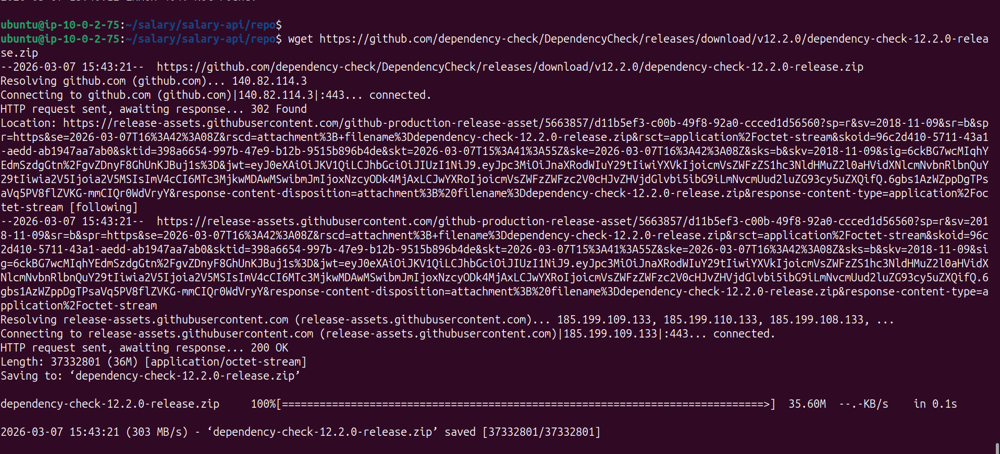
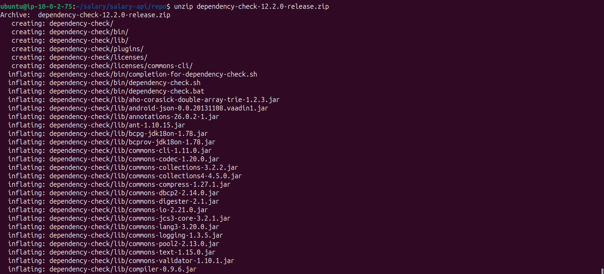
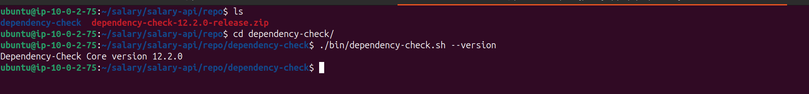
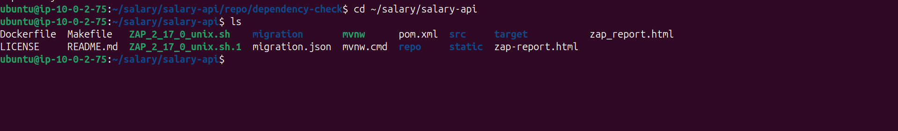
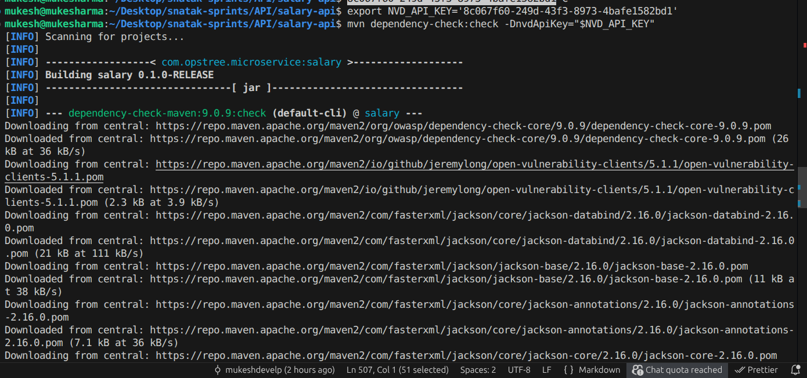

# Dependency Scanning | Java CI Checks — POC


---


| Author | Created on | Version | Last updated by | Last edited on | Pre Reviewer | L0 Reviewer | L1 Reviewer | L2 Reviewer |
|--------|------------|---------|-----------------|----------------|--------------|-------------|-------------|-------------|
| Mukesh Sharma | 26-02-2026 | v1.0 | Mukesh Sharma | 26-02-2026 |  |  |  |  |

---

## Table of Contents

1. [Scope and context](#1-scope-and-context)
2. [Prerequisites](#2-prerequisites)
3. [Step 1 — Build the Java application](#3-step-1--build-the-java-application)
4. [Step 2 — Add OWASP Dependency-Check](#4-step-2--add-owasp-dependency-check)
5. [Step 3 — Configure thresholds and run in CI](#5-step-3--configure-thresholds-and-run-in-ci)
6. [Step 4 — Remediate and document](#6-step-4--remediate-and-document)
7. [Success criteria](#7-success-criteria)
8. [Contact Information](#8-contact-information)
9. [References](#9-references)

---

## 1. Scope and context

| Item | Description |
|------|-------------|
| **Application** | Java/Spring Boot microservice; Maven build; dependencies in `pom.xml`. |
| **Repo location** | Java project directory (e.g. **~/salary/salary-api** or your Maven project path). |
| **Build** | `mvn clean package` (or `make build`); produces the application JAR in `target/`. |
| **POC goal** | Add **OWASP Dependency-Check** to the CI pipeline for the Java (Maven) project; fail on high/critical CVEs. |

---

## 2. Prerequisites

| Requirement | Description |
|-------------|-------------|
| **Java and Maven** | Java 17+, Maven (per project `pom.xml`). |
| **Java project repo** | Clone or use the existing Java (Maven) project directory; ensure `pom.xml` is present. |
| **CI system** | GitLab CI, Jenkins, or similar (one pipeline for the POC). |
| **Scanner** | **OWASP Dependency-Check** (Maven plugin or CLI). Works on the project `pom.xml` and dependency tree. |

---

# Dependency Scanning for a Maven Project Using OWASP Dependency-Check (Without Adding It to Maven)

This guide shows how to run **OWASP Dependency-Check manually** for a Maven project **without modifying the `pom.xml`**. This approach is useful for quick scans, CI pipelines, or when you don't want to add plugins to the project.

---

# 1. Prerequisites

Make sure the following tools are installed on your system.

### Check Java

```bash
java -version
```

### Check Maven

```bash
mvn -version
```

### Install unzip (if not installed)

```bash
sudo apt update
sudo apt install unzip -y
```

---

# 2. Download OWASP Dependency-Check

Download the latest CLI version.

```bash
wget https://github.com/dependency-check/DependencyCheck/releases/download/v12.2.0/dependency-check-12.2.0-release.zip

```


Unzip it:

```bash
unzip dependency-check-12.2.0-release.zip

```


Move into the directory:

```bash
cd dependency-check
```

Verify installation:

```bash
./bin/dependency-check.sh --version
```


---

# 3. Go to Your Maven Project

Navigate to the root of your Maven project.

Example:

```bash
cd ~/salary/salary-api
```

Confirm the project contains a `pom.xml`.

```bash
ls
```

Expected output should include:

```
pom.xml
src/
```



---

# 4. Run Dependency Scan

Run the scanner and point it to your project directory.

```bash
/home/ubuntu/salary/salary-api/repo/dependency-check/bin/dependency-check.sh \
--project "Salary API" \
--scan . \
--format HTML \
--out dependency-check-report
```

Explanation:

| Option      | Description                       |
| ----------- | --------------------------------- |
| `--project` | Name of the project in the report |
| `--scan`    | Directory to scan                 |
| `--format`  | Output format                     |
| `--out`     | Folder where report will be saved |

---

# 5. Wait for Vulnerability Database Download

The first run will:

* Download the **NVD vulnerability database**
* Build a local cache

This may take **5–15 minutes**.

Later scans will be much faster.

---

# 6. View the Report

Open the generated report.

```bash
cd dependency-check-report
ls
```

You will see:

```
dependency-check-report.html
```

Open it:

```bash
xdg-open dependency-check-report.html
```

If running on a remote server, copy it to your local machine:

```bash
scp ubuntu@SERVER_IP:~/salary/salary-api/dependency-check-report/dependency-check-report.html .
```

Then open it in your browser.

---

# 7. Understanding the Report

The report shows:

* Vulnerable dependencies
* CVE IDs
* Severity levels

Severity Levels:

| Level    | Meaning                      |
| -------- | ---------------------------- |
| Critical | Very dangerous vulnerability |
| High     | Serious security risk        |
| Medium   | Moderate vulnerability       |
| Low      | Minor issue                  |

Example entry:

```
Dependency: jackson-databind
CVE: CVE-2022-42003
Severity: HIGH
```

---

# 8. Updating Vulnerable Dependencies

Once vulnerabilities are found, update the dependency version in `pom.xml`.

Example:

```xml
<dependency>
  <groupId>com.fasterxml.jackson.core</groupId>
  <artifactId>jackson-databind</artifactId>
  <version>2.17.0</version>
</dependency>
```

Then rebuild the project:

```bash
mvn clean install
```

Run the scan again to verify the vulnerability is fixed.

---

# 9. Clean Old Scan Data (Optional)

To delete cached vulnerability data:

```bash
rm -rf ~/.dependency-check
```

Next scan will download fresh vulnerability data.

---

# 10. Useful Scan Options

Scan and output multiple formats:

```bash
--format HTML,JSON
```

Fail scan if CVSS score is high:

```bash
--failOnCVSS 7
```

Example:

```bash
~/dependency-check/bin/dependency-check.sh \
--project "Salary API" \
--scan . \
--format HTML \
--failOnCVSS 7 \
--out dependency-check-report
```

---

# 11. Typical Workflow

```
Build Project
      ↓
Run Dependency Check
      ↓
Generate Security Report
      ↓
Fix Vulnerable Dependencies
      ↓
Run Scan Again
```

---

# 12. Advantages of CLI Scanning

* No modification to `pom.xml`
* Works with any project
* Easy to integrate into CI/CD
* Can scan multiple projects

---

# 13. Example Directory After Scan

```
salary-api
│
├── pom.xml
├── src/
│
└── dependency-check-report
      └── dependency-check-report.html
```

---


# OWASP Dependency Scanning Guide (Maven Project)

This guide explains **how to perform dependency vulnerability scanning in a Maven Java project using OWASP Dependency-Check**. It is designed for **beginners** who are running dependency scanning for the first time.

---

# 1. What is Dependency Scanning?

Dependency scanning checks the **third-party libraries used in your project** for **known security vulnerabilities (CVEs)**.

Example:
If your project uses an outdated `log4j` library with a known vulnerability, the scanner will detect it and report the risk.

OWASP Dependency-Check compares your dependencies against the **National Vulnerability Database (NVD)**.

---

# 2. Prerequisites

Before starting, ensure the following tools are installed.

### Check Java

```bash
java -version
```

Expected output (example):

```
openjdk version "17.x.x"
```

### Check Maven

```bash
mvn -version
```

If Maven is not installed (Ubuntu):

```bash
sudo apt update
sudo apt install maven -y

```
**Expected Output**


---

# 3. Navigate to Your Maven Project

Go to your project directory that contains `pom.xml`.

Example:

```bash
cd salary-api
mvn clean install
mvn clean package -DskipTests
```
**Expected Output**


Project structure example:

```
salary-api
│
├── pom.xml
├── src
│   └── main
│       └── java
└── target
```

---

# 4. Add OWASP Dependency-Check Plugin

Open the **pom.xml** file and add the plugin inside the `<plugins>` section.

```xml

<plugins>

  <plugin>
    <groupId>org.owasp</groupId>
    <artifactId>dependency-check-maven</artifactId>
    <version>9.0.0</version>
  </plugin>

</plugins>

```

Save the file.


---

# 5. Generate an NVD API Key

OWASP downloads vulnerability data from the **NVD database**, which requires an API key.

1. Visit
   https://nvd.nist.gov/developers/request-an-api-key

2. Enter your email address.

3. You will receive an **API key in your email**.


Example API key:

```
abcd1234-xxxx-xxxx-xxxx-xxxxxxxx
```


---

# 6. Run the Dependency Scan

Run the following command:

```bash
export NVD_API_KEY=xxxxxxxxxxxxxxxxxxxxxxxx
docker run --rm \
  -v "$(pwd)":/src \
  owasp/dependency-check:latest \
  --scan /src \
  --project "salary" \
  --format HTML \
  --out /src/target
```





Example:

```bash
rm -rf ~/.m2/repository/org/owasp
rm -rf ~/.dependency-check
curl -s -w "\nHTTP code: %{http_code}\n"   -H "Accept: application/json"   -H "apiKey: $NVD_API_KEY"  "https://services.nvd.nist.gov/rest/json/cves/2.0?resultsPerPage=2000&startIndex=0"

mvn dependency-check:check -DnvdApiKey=abcd1234-xxxx

```


What happens during the scan:

1. Maven downloads project dependencies
2. OWASP downloads vulnerability data
3. Dependencies are matched with known CVEs
4. A vulnerability report is generated

---

# 7. Locate the Scan Report

After the scan finishes, the report will be generated in:

```
target/dependency-check-report.html
```

---

# 8. Open the Report

If you are running locally:

```bash
xdg-open target/dependency-check-report.html
```


If the scan was run on a server:

```bash
scp user@server:/project/target/dependency-check-report.html .
```

Open the file in a browser.

---

# 9. Understand the Report

The report will show vulnerabilities in a table.

Example:

| Dependency       | CVE            | Severity |
| ---------------- | -------------- | -------- |
| log4j-core       | CVE-2021-44228 | Critical |
| jackson-databind | CVE-2020-36518 | High     |

Severity levels:

* Critical
* High
* Medium
* Low

---

# 10. Fix Vulnerable Dependencies

Update vulnerable libraries in `pom.xml`.

Example (old version):

```xml
<dependency>
  <groupId>org.apache.logging.log4j</groupId>
  <artifactId>log4j-core</artifactId>
  <version>2.14.1</version>
</dependency>
```

Updated version:

```xml
<version>2.17.2</version>
```

After updating:

```bash
mvn clean install
```

Run the scan again.

---

# 11. Optional: Fail Build if Vulnerabilities Exist

You can configure the build to fail if high-severity vulnerabilities are found.

Add this configuration in the plugin:

```xml
<plugin>
  <groupId>org.owasp</groupId>
  <artifactId>dependency-check-maven</artifactId>
  <version>9.0.0</version>
  <configuration>
      <failBuildOnCVSS>7</failBuildOnCVSS>
  </configuration>
</plugin>
```

This will fail the build if vulnerabilities have a **CVSS score ≥ 7**.

---

# 12. Typical DevSecOps Workflow

```
Developer Commit
       ↓
Maven Build
       ↓
Unit Tests
       ↓
OWASP Dependency Scan
       ↓
Generate Vulnerability Report
       ↓
Fix Vulnerable Dependencies
```

---

# 13. Useful Commands

Run dependency scan:

```bash
mvn dependency-check:check
```

Full build + scan:

```bash
mvn clean install dependency-check:check
```

Run with API key:

```bash
mvn dependency-check:check -DnvdApiKey=YOUR_API_KEY
```

---

# 14. Best Practices

* Run dependency scanning in **CI/CD pipelines**
* Regularly update dependencies
* Monitor **Critical and High vulnerabilities**
* Combine dependency scanning with:

  * Static Code Analysis
  * Container Security Scanning
  * Secret Scanning


---

## 6.1. Dependency-check using Docker (alternative)

Use the official OWASP Dependency-Check Docker image when the Maven plugin cannot reach the NVD (e.g. 403 from your network). No `pom.xml` changes required.

**Prerequisite:** Docker installed (`docker --version`).

### Commands for this project (salary-api)

From the **project root** (directory that contains `pom.xml`):

```bash
# 1. Go to the Java project (e.g. salary-api)
cd /path/to/snatak-sprints/API/salary-api

# 2. (Optional) Build the project so JAR/dependencies exist
mvn clean package -DskipTests

# 3. Run dependency-check in Docker (with NVD API key for faster first run)
export NVD_API_KEY='your-nvd-api-key-here'
docker run --rm \
  -v "$(pwd)":/src \
  -e NVD_API_KEY="$NVD_API_KEY" \
  owasp/dependency-check:latest \
  --scan /src \
  --project "salary" \
  --format HTML \
  --out /src/target \
  --nvdApiKey "$NVD_API_KEY" \
  --nvdApiDelay 6000
```

**Without NVD API key** (slower; first run can take a long time):

```bash
cd /path/to/snatak-sprints/API/salary-api
docker run --rm \
  -v "$(pwd)":/src \
  owasp/dependency-check:latest \
  --scan /src \
  --project "salary" \
  --format HTML \
  --out /src/target
```

**Skip NVD update** (use only if you already have a local cache from a previous run):

```bash
docker run --rm \
  -v "$(pwd)":/src \
  owasp/dependency-check:latest \
  --scan /src \
  --project "salary" \
  --format HTML \
  --out /src/target \
  --noupdate
```

### Report location

After a successful run:

- **HTML report:** `target/dependency-check-report.html`
- Open in a browser: `xdg-open target/dependency-check-report.html` (Linux) or open the file manually.

### One-liner (with API key set in env)

```bash
cd /path/to/snatak-sprints/API/salary-api && \
docker run --rm -v "$(pwd)":/src -e NVD_API_KEY="$NVD_API_KEY" \
  owasp/dependency-check:latest \
  --scan /src --project "salary" --format HTML --out /src/target \
  --nvdApiKey "$NVD_API_KEY" --nvdApiDelay 6000
```

---

## 7. Success criteria

| Criterion | Status |
|-----------|--------|
| Java application builds successfully in CI (`make build` or `mvn clean package`). | ☐ |
| OWASP Dependency-Check runs in CI on the Java project. | ☐ |
| Scan report is published as an artifact (or visible in security dashboard). | ☐ |
| Pipeline fails on high/critical CVEs (per configured threshold). | ☐ |
| At least one vulnerability is remediated and pipeline passes after fix. | ☐ |
| Process is documented (scanner, threshold, commands). | ☐ |

---

## 8. Contact Information

| Name | Email Address |
|------|----------------|
| Mukesh kumar Sharma | msmukeshkumarsharma95@gmail.com |

---

## 9. References

| Link | Description |
|------|-------------|
| [Dependency Scanning — Java CI Checks Documentation](https://github.com/Snaatak-Saarthi/documentation/blob/SCRUM-172-mukesh/Applications/Understanding/Java_CI_Checks/Dependency_Scanning/README.md) | Main design document for dependency scanning and Java CI checks. |
| [OWASP Dependency-Check](https://owasp.org/www-project-dependency-check/) | OWASP Dependency-Check — vulnerability detection for dependencies. |
| [OWASP Dependency-Check Maven Plugin](https://jeremylong.github.io/DependencyCheck/dependency-check-maven/) | Maven plugin for dependency-check. |

---
